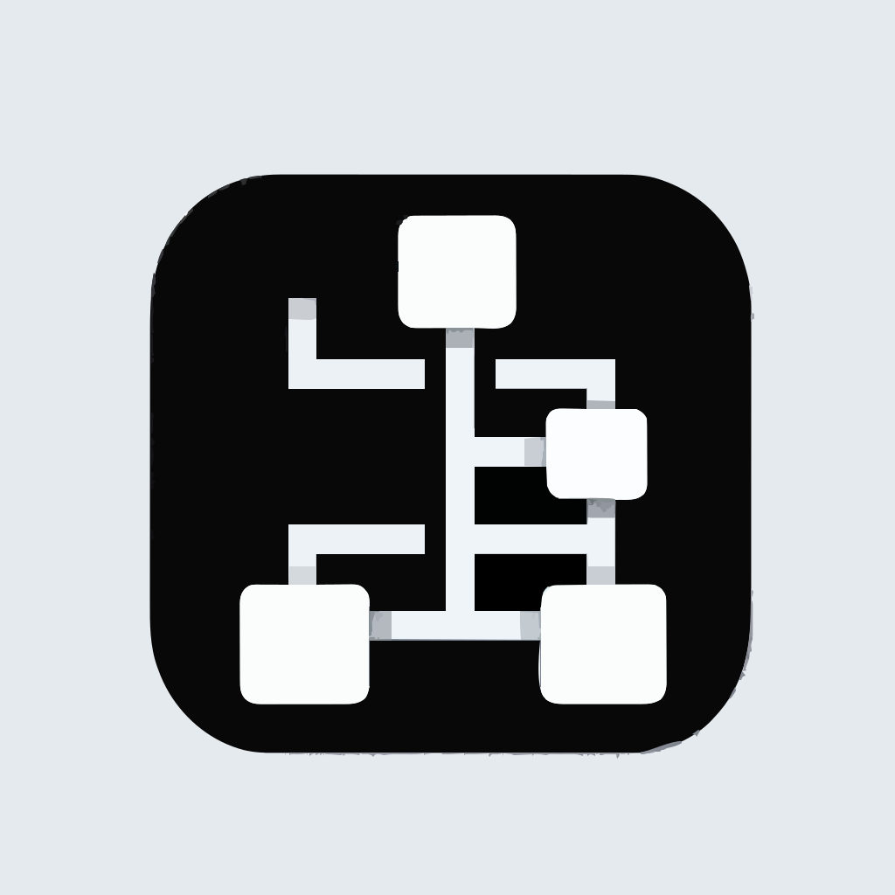

*(This icon was generated by DALL-E-3)*

# Dify DSL Flowchart Export

Convert dify app dsl to mermaid flowchart

- **Author**: Zoku-777
- **Version**: 0.0.1
- **Type**: extension
- **Repo**: https://github.com/Zoku-777/dify_dsl_flowchart_export
- **Feature Request**: [github issues](https://github.com/Zoku-777/dify_dsl_flowchart_export/issues)

## Usage

1. Install it
2. Setup a endpoint
   - set the endpoint name
   - input your **Dify access token**
   - choose your Dify app flow
   - choose the direction of the flowchart
   - input your dify console api domain (default:localhost)
3. Access the endpoint

### How to get the access token

#### By using Dify login console api

- **api_url**: {your_dify_domain}/console/api/login
- **body**:

```json
{
   "email":"xxxxxxxx@xxxx.com",
   "password":"xxxxxxxxxxxxxx"
}
```

- **response sample**:

```json
{
    "result": "success",
    "data": {
        "access_token": "{your access_token}",
        "refresh_token": "{your refresh_token}"
    }
}
```

#### By using browser login

**Especially with Google/GitHub account login**

1. Access the login page of your dify
2. Choose the google/github auth
3. Login with your google/github account
4. Focus on the URL changes during the `login request`
5. The access url(like under) includding your access_token will appear for a moment

```txt
https://cloud.dify.ai/apps?access_token={your access_token}&refresh_token={your refresh_token}
```

※If you have any other way to get the access token, we would appreciate it if you could share it in the [GitHub issue](https://github.com/Zoku-777/dify_dsl_flowchart_export/issues).

## About Dify access token

- We **only use** it to access the Dify app flow DSL.
- We **do not** save the data from the DSL, but only use it to make the flowchart.
- The access token might need to be re-acquired if it has expired.
 